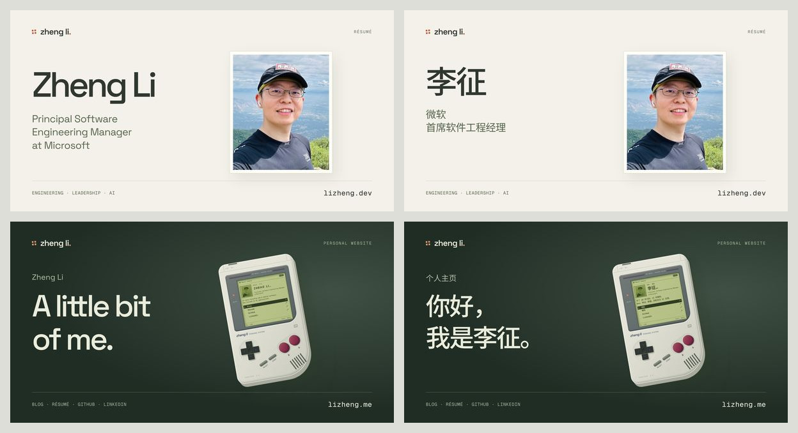

# 15 — SEO、agent 与社交分享优化

日期：2026-09-07。状态：应用侧本地实现与本轮文案复验完成，供 review。边缘放行与上线验证待完成，尚未提交、推送或部署。审计基线为 main `935ab35`，两站线上版本均为 v3.1.4。

目标是让搜索引擎、通用 agent 与分享预览准确理解同一个人、两个不同的页面用途：**dev 是专业履历，me 是个人主页与链接入口**。me 沿用现有 Game Boy / Play 和六种设备的视觉设计，文字直接介绍个人背景、页面内容和设备功能。

## 1. 现状与本轮目标

近期变化包括双站重建、六种设备界面、Journal / Play / Résumé 共同框架、三态主题、交互性能修复和 Portfolio 入口。SEO 基础已经存在；主要缺口是这些变化尚未完整进入公开文本、分享文案与配图。

| 维度 | 已验证现状 | 本轮交付 |
| --- | --- | --- |
| SEO 自评 | me 82/100，dev 90/100 | 补齐语义边界、中文 metadata、页面主题与明确的未知 URL 行为 |
| Agent 自评 | me 65/100，dev 80/100 | 通用读取客户端可达；HTML 与 Markdown 内容完整、同源、可发现 |
| robots / llms | 两站已有 wildcard Allow、sitemap、基础 llms.txt、两种语言 Markdown | 保持公开抓取，增加用途说明和可见入口，修复边缘阻断 |
| 社交分享 | 页面和图片的模拟 Facebook / Microsoft 预览请求成功；两站图片都以职业信息为主 | 四张按访问面和语言区分的图片，与四套标题、描述准确对应 |
| 语言与实体 | canonical、hreflang、ProfilePage → Person 已存在；中文标题仍是英文 | 中文标题和图中文字本地化；跨站、跨语言使用稳定的人物标识 |

上述分数是源码与线上抽样支持的工程自评，不是 Lighthouse 或实际收录率。实施后按原审计的五项、每项 20 分重新评分，目标为两站 SEO 与 agent 均达到 95/100；以下验收证据优先于分数。社交分享单独记录通过项和平台缓存观察，不凭 UA 模拟给实际平台效果打满分。

两站默认 `Python-urllib/3.14` 在首页、robots、llms 和 Markdown 均得到 403 / `error code: 1010`。同一 Python 实现换用 requests、curl、Node 或普通审阅 UA 则成功。已确认客户端签名相关阻断；具体 Cloudflare 配置项和规则 ID 仍需读取设置及事件后确定。

## 2. 四套分享文案

下列文案已在本地实现，供 review。`title` 同时供 HTML title、Open Graph 和 Twitter 使用；`description` 同时供页面摘要与两套社交标签使用。正文中的正式职位继续保留 `Principal Software Engineering Manager`。

| 页面 | Title |
| --- | --- |
| dev / en | Zheng Li — Principal Engineering Manager at Microsoft |
| dev / zh | 李征 — 微软首席软件工程经理 |
| me / en | Zheng Li — Personal Website |
| me / zh | 李征 — 个人主页 |

**dev / en description**

> Principal Software Engineering Manager at Microsoft, leading teams across web, mobile, and AI. Experience, leadership, and selected work.

**dev / zh description**

> 微软首席软件工程经理，专注 Web、移动与 AI 产品交付、跨职能团队建设和工程领导力。查看工作经历、教育背景与专利。

**me / en description**

> Zheng Li’s personal website, with links to his blog, résumé, GitHub and LinkedIn. Six interactive devices cover games, computing, music and riding.

**me / zh description**

> 李征的个人主页，收录博客、简历、GitHub 与 LinkedIn。六个可交互的设备界面，涵盖游戏、通信、计算机、音乐、骑行和摩托。

me 的英文 H1 为 `A little bit of me.`，保留两行排版和真实空白；中文 H1 为“你好，我是李征。”。副标题是“软件工程与团队管理。Web、移动、数据与 AI。” / “Software engineering and team leadership. Web, mobile, data and AI.”。

页面介绍为“这里可以找到我的博客、简历、GitHub 和 LinkedIn。六个设备界面分别对应游戏、通信、计算机、音乐、骑行和摩托。”。设备说明、轮播状态、屏幕内提示和分享图采用同样的直接语气；职业身份和同语言 Résumé 入口仍完整保留。

裸域名继续按 Accept-Language 302 到语言页，并返回 `Vary: Accept-Language`。没有语言偏好的请求仍落在 `/en/`。需要中文分享卡片时使用明确的 `/zh/` URL；不按平台名称或 User-Agent 猜语言。

## 3. 配图与预览协议

每个页面都有一张固定的 **1200 × 630** 分享图，使用自托管 JPEG，建议每张不超过 500 KiB。图中文字由确定性的模板排版；姓名、中文、职位和域名不交给生成模型绘制。图片不随主题或随机设备选择而变化。

| 项目 | dev / Résumé | me / Play |
| --- | --- | --- |
| 主体 | [原始真实肖像](../assets/source/portrait.jpeg)，沿用自然肤色与现有裁切方向 | 现有 Game Boy 作为主物件，橄榄绿屏幕、象牙色机身、橙色按键；可配一个小物件 |
| 构图 | 姓名和职位在左，肖像在右；浅色纸面、细线、克制的橙色标记 | 较大的掌机在右，姓名和短句在左；沿用纸色、石墨灰与橙色的材质关系 |
| 英文图中文字 | Zheng Li / Principal Software Engineering Manager / at Microsoft / lizheng.dev | Zheng Li / A little bit of me. / PERSONAL WEBSITE / lizheng.me |
| 中文图中文字 | 李征 / 微软首席软件工程经理 / lizheng.dev | 个人主页 / 你好，我是李征。 / PERSONAL WEBSITE / lizheng.me |
| 视觉重点 | 真实身份、清晰层级、专业可信 | 掌机造型、设备细节与清晰的个人标识 |
| 英文图片 alt | Zheng Li, Principal Software Engineering Manager at Microsoft, with a portrait. | A Game Boy beside Zheng Li’s name and “A little bit of me.” |
| 中文图片 alt | 李征的肖像及姓名、微软首席软件工程经理职位。 | Game Boy 掌机与“你好，我是李征。”文字。 |

保留共同的橙色四方标和 Space Grotesk 品牌字。姓名、职位或主短句距画布边缘至少 64px；在 600 × 315 与 360 × 189 预览下检查可读性。另看居中方形裁切后的主体识别度，平台裁切无法完全由本站控制。

**已生成的四张图**

| 访问面 / 语言 | 原尺寸图片 | 大小 |
| --- | --- | ---: |
| dev / en | [专业肖像与英文职位](../design-public/design-assets/social/resume-en.0d5cc18f26f0.jpg) | 70,697 B |
| dev / zh | [专业肖像与中文职位](../design-public/design-assets/social/resume-zh.39e3925a8475.jpg) | 63,991 B |
| me / en | [Game Boy 与 A little bit of me.](../design-public/design-assets/social/landing-en.7f8383af8026.jpg) | 62,725 B |
| me / zh | [Game Boy 与你好，我是李征。](../design-public/design-assets/social/landing-zh.dc9c945a1c83.jpg) | 63,591 B |

每张均为 1200 × 630 JPEG，路径清单位于 [social-images.json](../packages/publishing/social-images.json)。部署后将分别由对应正式域名下的 `/design-assets/social/` 路径提供；当前图片文件和本地 HTTPS 预览已可 review。重复生成使用 `bun run assets:social`，姓名与职位直接读取公开 frontmatter。

已检查 600 × 315、360 × 189 和中心方形裁切。最后一轮将肖像向内移动 110px、掌机向内移动 145px，减少紧裁切时主体被截断；宽卡片保留完整标题，方形裁切侧重人物和掌机的可识别性。平台仍可能裁掉图中文字，应以页面 OG title 提供完整标题。

**素材流程**

1. dev 优先直接使用真实肖像；me 优先从当前掌机设计生成固定场景。先 review 这两种构图是否足够。
2. 若 me 需要更有质感的独立静物素材，使用用户指定的本机技能 `../workflow/agents/skills/azure-gpt-image-cover/SKILL.md`，调用 `gpt-image-2`，`high`，原生 `1024x1024`。保留完整原生构图，以 contain 方式放入分享画布，再叠加文字。
3. 建议给模型的主体提示词：`A studio product photograph for a personal website: one ivory handheld console, olive monochrome screen, terracotta buttons, precise material details, soft directional lighting, warm paper and graphite palette, a single small cartridge nearby. The entire handheld and its shadow are visible with generous breathing room. Original unbranded industrial design, no lettering, no numbers, no logos, no people. Square composition.`
4. 认证采用 workflow 已有环境变量 `AZURE_OPENAI_ENDPOINT` / `AZURE_OPENAI_API_KEY` 和脚本；密钥不复制到本站配置、文档或命令参数中。素材生成不成为日常 build 或 CI 的外部 API 依赖。
5. 生成的原图与出处信息保存在源码素材目录，最终衍生图记录来源和生成参数。dev 肖像直接使用真实照片；生成模型可用于背景材质。

**发布契约**

- 生成四个带内容哈希的 URL，例如 `/design-assets/social/resume-en.<hash>.jpg`，另外三个为 `resume-zh`、`landing-en`、`landing-zh`。实际文件名和尺寸进入生成清单，metadata 从该清单取值。
- 四页分别输出绝对 HTTPS 的 `og:image`，以及 MIME、width、height、本地化 alt；补 `og:site_name`、`og:locale:alternate`。显式输出 Twitter title、description、image、image:alt，保持 `summary_large_image`。
- 分享图生成职责已从 [create-portraits.ts](../scripts/create-portraits.ts) 移到 [create-social.tsx](../scripts/create-social.tsx)，避免 `assets:design` 将新图覆盖回旧职业名片。
- 只对符合内容哈希清单的分享图使用长期 immutable 缓存；当前其他稳定文件名的图片继续正常重新验证。旧 `social-landing.png` / `social-resume.png` 暂留，支持旧卡片和回滚。
- 修改图或图中文字时生成新的文件 URL；页面 HTML 继续重新验证。新 URL 能绕过旧图片缓存，平台已有链接预览仍可能需要重新抓取。
- 图片 GET/HEAD 直接返回 200 与正确 image MIME，无需 cookie、JavaScript 或登录。分享图不加入页面首屏 preload，也不计作必须下载的正文图片。

## 4. 公开内容与 agent 入口

### 4.1 让设备说明进入同一份公开内容

在两份 landing Markdown 中保存页面介绍，以及六个设备名称和说明。保留简介中的经历事实、身份和四个链接；扩展 landing 专用内容模型，继续限定为 [四份公开文档](content/README.md)。工程文档、图像提示词与审计记录不进入导出。

| 设备 | 章节 | 英文说明 | 中文说明 |
| --- | --- | --- | --- |
| Game Boy | PLAY | Handheld games and pixel graphics. | 掌机上的像素游戏。 |
| Nokia 5300 | CONNECT | Calls and messages, with a physical keypad. | 用实体键盘打电话、发短信。 |
| Macintosh Plus | CREATE | Windows, documents and desktop tools. | 窗口、文档与桌面操作。 |
| iPod Classic | LISTEN | A music library, controlled with a click wheel. | 用转盘浏览音乐库。 |
| Garmin Edge 540 | EXPLORE | Cycling routes and ride data. | 查看骑行路线和运动数据。 |
| Honda Africa Twin | RIDE | Speed, gears and motorcycle instruments. | 车速、挡位与摩托仪表。 |

这些说明描述设备的功能，不推导购买年份、拥有顺序或新的生平事实。`DeviceId`、控制器和动效参数留在体验层；设备说明、页面介绍由公开内容模型提供。

HTML 增加一个紧凑的原生 `details` 设备目录，含六个名称与说明，中英文 summary 为“设备与界面” / “Devices”。文字在首次响应中存在，用户关闭 JavaScript 后仍能用键盘展开阅读；目录与完整 Markdown 都来自同一模型。保留已有单场景 SSR 和缓存设备的 `inert` / `aria-hidden` / `display: none` 行为。

[render.tsx](../packages/publishing/render.tsx) 从 hydration 数据清除 `sections`，保留页面需要的设备内容，使 SSR 与 hydration 一致；不把完整原始 Markdown 或所有复杂设备 DOM 装入客户端。

### 4.2 可发现的机器阅读入口

- 在共享页脚增加本页 `Markdown` 与 `llms.txt` 的真实链接，沿用紧凑布局。HTML head 的 Markdown alternate 改用绝对的同语言 URL。
- `/llms.txt` 分别写明 Play 和 Résumé 的用途、英文/中文 HTML 与 Markdown、本站 sitemap，以及 Journal / Play / Résumé 的关系。说明公开页面欢迎搜索与 AI 客户端读取；职业事实指向 dev，个人物件指向 me，文章指向 blog。
- llms.txt 从经过校验的公共 metadata 生成，避免继续维护另一组姓名与职业描述常量。
- HTML 与 Markdown 响应提供 HTTP `Link` 发现信息。可借鉴 Firefly 的 `rel="service-doc"` 指向 llms.txt；HTML 同时列出 `rel="alternate"; type="text/markdown"`。
- `/en/content.md`、`/zh/content.md` 及现有短别名返回正确 Markdown MIME；HTTP `rel="canonical"` 指向同语言 HTML 主页面，明确它们是该页面的文本表示。
- 保持 robots 的单一 `User-agent: *` / `Allow: /`，sitemap 只列本访问面的规范语言页。正式站不发送 `X-Robots-Tag`，HTML 不限制索引或跟随链接。开发预览和隔离测试仅发送 `X-Robots-Tag: noindex`，允许读取和跟随链接，避免测试页面进入索引；已移除多余的 `nofollow`。2026-09-07 实际请求两个正式站，响应中均无该标头。

参考本机 `../firefly` 的 [llms 路由](https://github.com/nocoo/firefly/blob/a31686dac43e5dfcc7ce022cddab1633e55ab911/src/app/llms.txt/route.ts)、[公开页脚](https://github.com/nocoo/firefly/blob/a31686dac43e5dfcc7ce022cddab1633e55ab911/src/components/blog/blog-footer.tsx) 和 [Link 响应头](https://github.com/nocoo/firefly/blob/a31686dac43e5dfcc7ce022cddab1633e55ab911/next.config.ts)。跨仓库引用使用版本链接，使独立 CI checkout 也能校验本站文档。只借鉴适用于两站的发现能力。

`llms.txt` 是社区约定，不保证任何特定产品会读取。`llms-full.txt` 和 `Accept: text/markdown` 内容协商放在后续候选项：当前优先保证已有两个明确 Markdown 入口完整。若以后实现协商，要正确处理媒体类型优先级、q=0、HEAD、`Vary: Accept` 和缓存。单数 `/llm.txt` 不属于缺失功能。

### 4.3 人物与页面的关系

保留 ProfilePage → Person，统一 Person `@id` 为 `https://lizheng.me/#person`；四页各自保留规范 URL 与独立的 ProfilePage 标识。姓名、正式职位、Microsoft 雇主和真实肖像来自已有公开事实，图片使用同一份公开肖像。

补齐已公开的 me、dev、blog、GitHub、LinkedIn 和 X 身份链接。Portfolio 是相关入口，不自动把外链上的组织或产品视作同一个 Person。metadata 与 JSON-LD 从经过校验的内容模型生成，保持安全转义。

## 5. 系统清理文本边界

| ID | 已观察到的抽取结果 | 建议改动 |
| --- | --- | --- |
| T1 | `A littlebit of me.` | H1 换行处补真实空白，视觉仍分两行 |
| T2 | `An engineer’s mind.An explorer’s curiosity.` | 两个英文句子之间补真实空白 |
| T3 | `Engineering Manager@ Microsoft` | 职位与 `@ Microsoft` 之间保留词边界 |
| T4 | `© 2026 Zheng Liv3.1.4` / `reserved.v3.1.4` | 页脚版权与版本用可见的 ` · ` 分隔 |
| T5 | `01Professional Summary` / `01职业概述` / `MADE IN BEIJING39.90°…` | 章节编号、文字及地点签名之间增加真实分隔 |
| T6 | `Zheng Li_` / `李征_` | 用 CSS 形状绘制光标，让下划线退出姓名文本 |

扫描静态 HTML、DOM textContent、innerText 和无障碍名称的差异，并为候选项给出位置和上下文。对混合语言、换行、链接相邻文本、数字装饰及页脚优先检查；不做自动全站空格替换。

T1 的浏览器 innerText 与无障碍树已有正常边界，不能把原始文本连写直接称为 Google 索引中的拼写错误。T4 在 me 的无障碍树也发生粘连，应作为姓名语义缺陷修复。Nokia `2abc` 等键盘标签是有效例外；英文品牌、导航和地点签名继续按现有设计契约保留。

## 6. 边缘可达性与 URL

**E1：解决 403 / 1010。** 先读取两个域的相关设置与请求事件，记录当前值、命中规则和可回滚配置。若确认是 Browser Integrity Check，对本站明确的公开只读资源使用范围受限的配置或跳过规则：两个站及 www 的 GET/HEAD，覆盖根路径、语言页、robots、llms、sitemap、公开 Markdown 和公开图片/字体/脚本。变更只处理实际触发的检查项，随后复测 Python 默认 UA 及其他客户端。

规则按照公开资源范围生效；不依赖只要自称 Googlebot 就获准的身份判断，也不改变 HTML 内容来迎合特定 UA。保留应用 405、内部路径 404、未命中资源处理及其他正常防护。查看 AI bot/managed robots 配置是否与欢迎公开抓取的目标一致；记录实际观察，不从应用中的 Allow 推断边缘已放行。

已准备可 review 的 [BIC 规则草案](evidence/15-bic-rule-draft.json)。只有在读取设置与事件、确认 BIC 是原因后，才将该 payload 添加到两域各自的 `http_request_firewall_custom` 入口 ruleset。动作仅为 `skip` 的 `products: ["bic"]`；不跳过其他 WAF 规则、rate limit 或整个 phase。官方 [skip options](https://developers.cloudflare.com/waf/custom-rules/skip/options/) 明确 BIC 属于 product。应用前需保存旧设置/规则列表及新增 rule ID；回滚删除该新增规则即可。

当前凭证读取域信息成功，但两域 `/settings/browser_check` 均返回 403 / 9109，`/rulesets` 均返回 403 / 10000。已请求具有相应 Zone Settings Read / Zone WAF Edit 权限的本地凭证位置，尚未取得；草案未应用，也未把推测当成已确认的规则。

**U1：推荐将真正未知的 me 路径改为 404。** `/` 仍按语言 302，明确语言页和资产继续各自处理。该项会改变 [03 路由契约](03-routing-contract.md) 中 me 的通用 302 回落，应在同一实现提交更新文档和回归断言；列为本轮明确的兼容性变更供 review。

me 的 12 类旧博客规则继续原样 301，包含 `/sitemap.xml`，保留查询参数、编码与匹配边界；本站 sitemap 仍为 robots → `/sitemap-index.xml` → `/sitemap-pages.xml`。`.dev` 不应用旧博客规则。

www 和无尾斜杠语言 URL 目前有正确 canonical，本轮保持可用。永久归一化跳转作为后续单独决定，不与旧博客跳转混在同一泛化规则中。sitemap 的 lastmod 只有在有真实内容修改时间来源时才增加。

## 7. 实施顺序与文件范围

| 批次 | 具体交付 | 主要文件 | 完成条件 |
| --- | --- | --- | --- |
| M1 内容与语义 | 页面介绍及六个设备说明进入公开源；紧凑无 JS 目录；T1–T6；稳定人物身份 | 四份 content Markdown、[model.ts](../packages/content/model.ts)、[LandingPage](../apps/landing/LandingPage.tsx)、[ResumePage](../apps/resume/ResumePage.tsx)、[SurfaceChrome](../packages/experience/SurfaceChrome.tsx)、[GameBoy](../apps/landing/devices/GameBoy.tsx)、[device-gallery.ts](../packages/experience/device-gallery.ts)、render | 四页语义清晰，两个 me Markdown 内容完整，SSR/hydration 一致 |
| M2 metadata 与配图 | 四套文案、四张图片、生成清单、OG/Twitter 全字段、素材构建分工 | content frontmatter、publishing metadata 模块、render、[build.tsx](../scripts/build.tsx)、create-portraits、独立 social 图片脚本、design-public | 四个 URL 的标题/摘要/图片成套对应，小图可读，日常构建无需模型调用 |
| M3 抓取入口与 URL | 更完整 llms、页脚与 HTTP Link、Markdown canonical、U1 真 404、E1 边缘修复 | [routes.ts](../packages/publishing/routes.ts)、[worker/index.ts](../worker/index.ts)、共享页脚、03 路由契约、两域 Cloudflare 设置 | 抓取矩阵通过；旧 301 契约全部通过；通用客户端可读取公开内容 |
| M4 发布验证 | 现有质量门禁、视觉与性能评审、线上抽样、重新评分和社交缓存记录 | [07 质量规范](07-quality-and-tdd.md)、[11 发布记录](11-release-implementation.md)、现有 CI/CD | 以下矩阵取得证据，版本与两站 `/api/live` 一致 |

E1 的只读排查从 M1 开始即可进行；无需等素材定稿再定位规则。代码按行为变更先写有效失败用例，再实现、回归和提交；不为纯文案增加逐字镜像测试。

职业年数继续按 [02 内容契约](02-content-contract.md) 记录的差异处理：`20 年代码`、`15 年微软`、`15 years web/mobile` 与 `2012–Present` 不自行统一。本轮短分享摘要采用已核实的领域和职位，新文案不会引入新的年数计算。

## 8. 验收与发布证据

| 验收面 | 范围与通过标准 |
| --- | --- |
| 内容边界 | 仅四份公开 Markdown；六个设备说明完整；dev 六章节、工作/教育/专利及链接完整；内部文档与生成提示词不进入公开产物 |
| 文本与无 JS | 四页面只有一个合理 H1；T1–T6 不再污染抽取；me 无 JS 可展开阅读六章；简历全文与标准链接正常；不开 JS 也能发现 Markdown |
| HTML / Markdown 同源 | 页面介绍、设备说明、身份与链接逐项对应；HTML 安全转义；hydration 无内容差异；允许排版不同 |
| Metadata | 两站 × 两语言，title / description / OG / Twitter / canonical / hreflang / JSON-LD 相互对应；中文标签与图片为中文；每张图有本地化 alt 和正确尺寸/MIME |
| 本地 HTTP | 真实 Worker 与构建产物验证 GET/HEAD、根路径、显式 locale、www、Markdown 两类别名、发现端点、图片、404/405、12 类旧 301；测试不请求生产 |
| 线上抓取抽样 | curl、默认 Python urllib、requests、Node；Googlebot、Bingbot、GPTBot、OAI-SearchBot、ChatGPT-User、ClaudeBot、PerplexityBot；facebookexternalhit、SkypeUriPreview、MicrosoftPreview。验证入口、两种语言、robots、llms、Markdown、sitemap 与新图的状态和内容 |
| 语言与缓存 | 根路径无语言偏好、英文和中文偏好；显式语言不被重新选择；HTML 可更新，哈希图 immutable；不同主机、locale 和资源类型不串缓存 |
| 视觉与交互 | 两站 × en/zh × light/dark；现有桌面、移动、缩放和浏览器矩阵；新增目录与页脚不溢出；掌机缓存、三态主题、键盘与正常动效保持可用 |
| 性能与门禁 | 逻辑覆盖率各指标 ≥95%，旧 301 分支 100%，G1 零错误/警告；沿用安全/体积门禁、LCP ≤2.5s、CLS ≤0.05 与实验室交互 ≤200ms 的既定测量条件；不提高阈值 |
| 实际社交卡片 | 部署后在可用的预览/调试入口检查四个语言 URL，记录平台、时间、标题、图片和缓存状态；模拟 UA 成功与平台真实抓取分别记录 |

扩展现有 [内容测试](../tests/unit/content.test.ts)、[发布测试](../tests/unit/publishing.test.tsx)、[边缘测试](../tests/unit/edge.test.ts) 和 [HTTP 矩阵](../tests/http/routes.spec.ts)。浏览器用现有 experience / surfaces / devices 场景验证新增内容、发现入口及视觉变化。完整实现须通过既有 commit、push 与 CI 门禁；已执行的检查见下方实际记录。

先生成并 review 四张图和四页最终 head，再进入既有 release 流程。现有 main CI 成功后会触发部署，不能把未完成的中间态当作纯备份推送。部署后检查两个 `/api/live`、公开读取矩阵和新图片，按既有流程做后续复查；边缘设置和应用版本分别保留回滚记录。

平台卡片可能缓存旧 HTML 或裁切图片。不能用本机 UA 请求冒充真实爬虫 IP 验证，也不能把本站 metadata 更新直接报告成 Teams / Facebook 的缓存已刷新。若调试入口需要账户或上下文，保留该项为未验证，给出准确的预期标题和图片 URL。

## 9. 本轮采用的方案与保留议题

1. dev 采用专业履历定位，me 沿用 Game Boy / Play 的个人入口定位；四套文案与配图已实现，供 review。
2. U1 的 me 未知路径 404 已纳入本轮，保留全部明确旧博客 301。
3. 年数差异保持待编辑确认；本轮不自动改写既有履历事实。

用户要求继续后，已将上述内容、语义、分享 metadata、四张图片、机器阅读入口及未知路径 404 在本地实现。配图用现有掌机组件和真实肖像确定性生成，未调用生图 API。边缘设置未修改；未提交、推送或发布版本。

### 首轮实现验证记录（本次文案修订前）

- 单元测试 254 项通过；覆盖率为 statements 100%、branches 99.41%、functions 100%、lines 100%。
- `check:static` 和四组真实 Worker HTTP 路由矩阵通过，覆盖 llms、发现响应头、图片格式/尺寸/缓存及旧 301。
- 三浏览器完整回归首轮 229/249 通过，20 项停在 Chromium 移动设备截图差异。检查实际图和差异图后更新对应基线，随后普通比较运行的这 20 项全部通过，包括截图后的设备控制断言；两轮合起来覆盖全部 249 项，不冒充首轮全绿。
- 本地 32 张基线更新：8 张 me 全页、20 张移动设备局部、4 张移动简历。CI 的 me 基线保留全部原平台像素，相关变化与平台差异零重叠；移动简历只转移不重叠的版权分隔像素、插入 48px 阅读入口行，保留原 CI 正文、中文字体、装饰和底部导航。阈值及遮罩均未改变；实际远程 CI 仍须在发布流程验证。
- 开发预览 10 项通过。先复现两站 llms.txt 404 的 Red，再同步生成路由、发现响应头和未知路径行为。
- 六个性能场景全部通过：Chromium、4× CPU、1.6Mbps 下行 / 0.75Mbps 上行、150ms 延迟、冷缓存、正常动效，每场景三个样本。各场景中位数 LCP 为 512–1036ms、CLS 最大 0.01924、最大交互时延中位数 32–88ms；保持 2500ms / 0.05 / 200ms 原预算。这是实验室测量，不代表真实用户 INP。
- OSV 依赖检查通过；`bun outdated` 未报告可更新依赖。Gitleaks 对当前改动文件的独立副本扫描通过；不是用零提交的历史扫描代替本轮文件检查。
- 资源体积门禁通过：dev 每语言约 170KiB、me 每语言约 224KiB，均低于现有 300 / 450KiB 预算。分享图片不进入正文首屏下载；最终静态检查零错误、零警告。
- 实际 Caddy HTTPS 的四页、四张最终图片、llms、Markdown 与未知路径已核对：页面/图片/文本均 200，未知路径 404，图片 SHA-256 与文件名一致。预览仍带 noindex，不将开发域名作为公开索引页。
- 远程 CI、生产部署、实际 Teams / Facebook 抓取及平台缓存尚未验证；生产评分保留审计基线，不能用本地通过情况冒充线上评分提升。
- Cloudflare 已登录凭证能读取域信息，但两域 BIC 设置读取返回 403 / 9109，WAF rulesets 读取返回 403 / 10000。具体触发规则仍未确认，默认 Python UA 的线上 1010 阻断仍是未解决项。

以上是本地实现证据，不表示生产已经更新，也不表示 Teams / Facebook 已重新抓取。

### 本次文案与抓取策略修订

按用户意见统一了页面、设备内提示、公开 Markdown、llms.txt、metadata 和分享图的语气。中文标题为“李征 — 个人主页”，H1 与分享图主句为“你好，我是李征。”；六个设备描述具体功能。dev 继续使用专业职位与真实肖像，装饰性标签改为工程、管理和 AI 领域。

开发预览和隔离 Worker 测试移除 `nofollow`，仅保留 `noindex`。既有边缘测试先复现旧标头不符合新要求，再验证修复；正式环境 HTML / Markdown 的响应同时断言不含该标头。实际 Caddy HTTPS 预览与两个正式站的两种语言均已读取核对：预览只有 `noindex`，正式站无限制性 robots 标头或 HTML 标签，robots.txt 继续 wildcard Allow。

新图已检查原图、600 × 315、360 × 189 与中心方形裁切。更新了 48 张 me 视觉基线（8 张全页、40 张设备局部）；CI 基线保留全部 9,296 个原平台差异像素，与本轮变化无重叠。中文字体子集为 207 个公开字符、59,856 B。截图阈值、遮罩和性能预算均保持原值。

本次单元测试 254 项通过，覆盖率仍为 statements / functions / lines 100%、branches 99.41%。三浏览器 249 项在一次常规比较运行中全部通过，无跳过或重试；四组真实 Worker HTTP 矩阵通过。热更新测试同步新的文案替换目标后，开发预览 10 项全部通过。构建、静态检查与体积门禁通过，零错误、零警告；dev 每语言约 170 KiB，me 每语言约 213 KiB。

六个性能场景全部通过，每场景三个样本，测量条件与预算沿用上方标准。各场景中位数 LCP 为 488–1048ms，CLS 最大 0.01924，最大交互时延中位数为 32–72ms。这是实验室测量；远程 CI、生产发布、Cloudflare 边缘放行与真实平台卡片缓存仍未验证。本节是当前本地证据，上方保留首轮实现记录。

### Review 入口

- dev：[English](https://lizheng-dev.dev.hexly.ai/en/) / [中文](https://lizheng-dev.dev.hexly.ai/zh/)
- me：[English](https://lizheng-me.dev.hexly.ai/en/) / [中文](https://lizheng-me.dev.hexly.ai/zh/)
- [四张分享图并排查看](evidence/15-social-previews.jpg)，原尺寸图片见第 3 节；标题和描述见第 2 节。

这些 HTTPS 地址使用本机现有 Caddy 映射。显式 `/zh/` 用于中文分享；正式域名在部署前继续返回旧版 metadata。

## 依据

- [llms.txt 社区约定](https://llmstxt.org/)
- [Google AI features 与网站要求](https://developers.google.com/search/docs/appearance/ai-features)：没有额外 AI 文件或特殊 schema 的收录要求。
- [Cloudflare 1010](https://developers.cloudflare.com/support/troubleshooting/http-status-codes/cloudflare-1xxx-errors/error-1010/) 与 [Browser Integrity Check](https://developers.cloudflare.com/waf/tools/browser-integrity-check/)
- [Open Graph 协议](https://ogp.me/)
